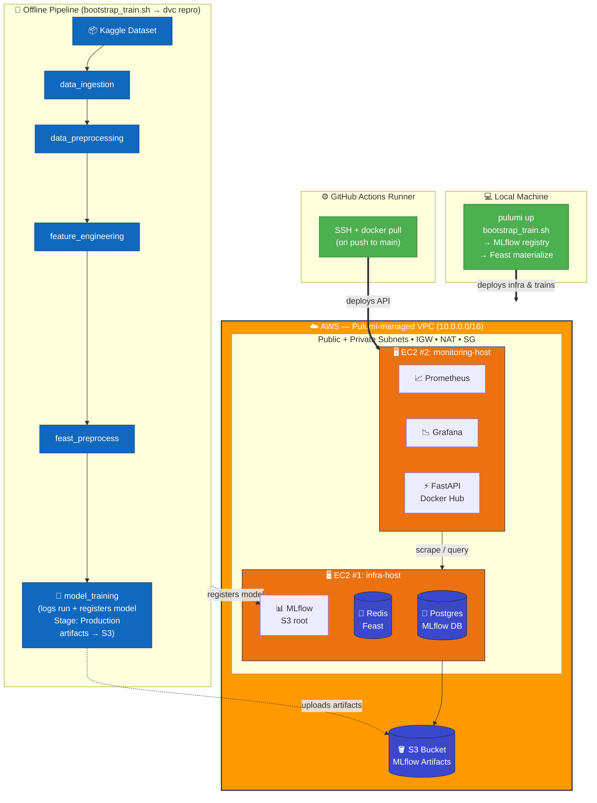

# ModelServe

Production ML serving platform for credit card fraud detection.
Built with FastAPI, MLflow, Feast, Redis, Postgres, Prometheus, Grafana, Docker, Pulumi (AWS), and GitHub Actions.

**MLOps with Cloud Season 2 — Capstone Project** (Poridhi.io)

---

## Architecture

Infra lives in AWS. Training happens on your local machine and pushes the model to the remote MLflow registry (artifacts go to S3). The FastAPI image is built + pushed by GitHub Actions on every push to `main`, then pulled and run on the monitoring EC2 host.



See `docs/ARCHITECTURE.md` for ADRs and design rationale.

---

## Three steps to "fully up"


### Repo setup
```
ssh-keygen -t ed25519 -C "anol.mahi@gmail.com"
eval "$(ssh-agent -s)"
ssh-add ~/.ssh/id_ed25519
cat ~/.ssh/id_ed25519.pub
git config --global user.name "Mahi"
git config --global user.email "anol.mahi@gmail.com"

```
### Step 1 — Provision the AWS infra (local)

```bash
chmod +x scripts/bootstrap_infra.sh
./scripts/bootstrap_infra.sh
```

Installs AWS CLI + Pulumi if missing, runs `aws configure` so you can paste in your access key + secret (this account has restricted access — no IAM users will be created), generates an SSH key at `~/.ssh/modelserve-key`, and runs `pulumi up`.

After it's done you'll have:
- a VPC with public + private subnets, IGW, NAT, route tables, SG
- 1 S3 bucket (MLflow artifact registry)
- EC2 #1 already running Postgres + Redis + MLflow
- EC2 #2 already running Prometheus + Grafana (FastAPI will land here in step 3)

Outputs (URLs to MLflow, Grafana, Prometheus, API) are printed at the end.

### Step 2 — Train the model (local)

```bash
chmod +x scripts/bootstrap_train.sh
./scripts/bootstrap_train.sh
```

Reads the Pulumi outputs, points `MLFLOW_TRACKING_URI` and Feast's Redis connection string at EC2 #1, runs the DVC pipeline end-to-end (ingestion → preprocessing → features → feast_preprocess → training), registers the model into MLflow with stage `Production`, uploads artifacts to S3, then runs `feast apply` and materializes features to the remote Redis.

After it finishes, **commit and push** so CI/CD can pick up the latest feature registry:

```bash
git add feast_repo/registry.db training/features.parquet training/sample_request.json
git commit -m "training: refresh model + feature registry"
git push origin main
```

Re-running `bootstrap_train.sh` later registers a **new** version of `fraud-detection-model` in MLflow. The new version is promoted to `Production` and the older one is archived — the rollback endpoint (below) lets you switch back to a previous version without retraining.

### Step 3 — Push to `main` (GitHub Actions does the rest)

On push, `.github/workflows/deploy.yml`:
1. Runs tests
2. Builds the FastAPI image with `docker buildx`
3. Pushes it to Docker Hub (`<DOCKER_IMAGE>:latest` and `<DOCKER_IMAGE>:<sha>`)
4. SSHes into EC2 #2 and `docker compose pull && up -d --force-recreate api`

Required GitHub repo secrets:

| Secret               | Value                                                              |
|----------------------|--------------------------------------------------------------------|
| `DOCKERHUB_USERNAME` | Docker Hub username                                                |
| `DOCKERHUB_TOKEN`    | Docker Hub access token                                            |
| `DOCKER_IMAGE`       | Full image repo, e.g. `mahianol/modelserve-api` (no tag)           |
| `EC2_HOST`           | `monitoring_host_public_ip` from Pulumi outputs                    |
| `EC2_SSH_KEY`        | Contents of `~/.ssh/modelserve-key` (PEM, including BEGIN/END)     |

Done. Hit the endpoints.

---

## API endpoints

Replace `<API_HOST>` with the `api_url` Pulumi output (i.e. `monitoring_host_public_ip:8000`).

| Endpoint                            | Method | Description                                          |
|-------------------------------------|--------|------------------------------------------------------|
| `/health`                           | GET    | Health check + current model version                 |
| `/predict`                          | POST   | Predict fraud for `{"entity_id": <cc>}`              |
| `/predict/{entity_id}?explain=true` | GET    | Predict + feature values used                        |
| `/rollback`                         | POST   | Switch to a previous MLflow model version            |
| `/metrics`                          | GET    | Prometheus exposition                                |

```bash
curl http://<API_HOST>/health

curl -X POST http://<API_HOST>/predict \
  -H 'Content-Type: application/json' \
  -d @training/sample_request.json
```

### Rollback

`POST /rollback` switches the currently-served model to a previous version registered in MLflow — no container restart, no redeploy. It also updates the MLflow Model Registry so a future restart comes up on the rolled-back version.

```bash
# Roll back to the most recent prior version (auto-pick)
curl -X POST http://<API_HOST>/rollback

# Roll back to a specific version
curl -X POST http://<API_HOST>/rollback \
  -H 'Content-Type: application/json' \
  -d '{"version": "2"}'
```

Response:
```json
{
  "status": "ok",
  "model_name": "fraud-detection-model",
  "previous_version": "3",
  "current_version": "2",
  "timestamp": "2025-..."
}
```

What it does, in order:
1. Resolves the target version (explicit `version` from body, else the most recent registered version that isn't currently loaded).
2. Loads that version into the live FastAPI process via `mlflow.pyfunc.load_model`.
3. Promotes the target to MLflow stage `Production` and archives the version that was previously serving.
4. Updates the `model_version_info` Prometheus gauge so `/health` and Grafana reflect the new active version immediately.

Returns `400` if the requested version doesn't exist or there's no prior version to roll back to. If the in-memory load fails, the previously-loaded model keeps serving traffic (no half-swapped state).

---

## Services and ports

| Service     | Host       | Port |
|-------------|------------|------|
| FastAPI     | EC2 #2     | 8000 |
| MLflow      | EC2 #1     | 5000 |
| Prometheus  | EC2 #2     | 9090 |
| Grafana     | EC2 #2     | 3000 (admin / admin) |
| Postgres    | EC2 #1     | 5432 (internal use) |
| Redis       | EC2 #1     | 6379 (internal use) |

The API container reaches Postgres / Redis / MLflow via the infra host's **private VPC IP**, mapped through `extra_hosts` in docker-compose so the Feast config baked into the image (`connection_string: redis:6379`) just works.

---

## Teardown

```bash
cd infrastructure
source venv/bin/activate
pulumi destroy --yes
```

This removes everything — VPC, EC2s, NAT, S3 bucket (with `force_destroy=True`).

---

## Local-only flow (optional)

The original single-machine flow still works for local dev/testing — `docker-compose.yml` at the repo root runs the entire stack on one machine:

```bash
docker compose up -d
# then run training inside the venv as before
```

This is no longer the primary path. Production now uses the two-script + CI flow described above.

---

## Project structure

```
modelserve/
├── app/                          # FastAPI inference service
│   ├── main.py                   # Endpoints (/health, /predict, /rollback, /metrics)
│   ├── model_loader.py           # MLflow model loader + rollback logic
│   ├── feature_client.py         # Feast online-store client
│   ├── metrics.py                # Prometheus metrics
│   └── schemas.py                # Pydantic request/response models
├── src/Pipelines/                # DVC pipeline stages
├── feast_repo/                   # Feast config + feature definitions
├── training/                     # train.py entrypoint + artifacts
├── infrastructure/               # Pulumi IaC
│   ├── Pulumi.yaml
│   ├── __main__.py               # VPC, EC2 x2, S3, SG, key pair
│   └── requirements.txt
├── monitoring/                   # Prometheus + Grafana config
│   ├── prometheus/               # prometheus.yml, alerts.yml
│   └── grafana/provisioning/     # auto-provisioned datasource + dashboard
├── scripts/
│   ├── bootstrap_infra.sh        # Script 1 — provision AWS infra
│   ├── bootstrap_train.sh        # Script 2 — train + register model
│   └── materialize_features.py
├── docker/mlflow/                # (local fallback)
├── docs/
│   ├── ARCHITECTURE.md           # ADRs + design rationale
│   └── GRAFANA_SETUP.md          # Dashboard guide
├── .github/workflows/deploy.yml  # CI/CD: test → build → push → deploy
├── docker-compose.yml            # Local-only dev stack
├── Dockerfile                    # FastAPI image (built by CI)
├── dvc.yaml
├── params.yaml
└── requirements.txt
```

---

## Notes on restricted AWS access

The Pulumi program does **not** create any IAM users or roles. The AWS credentials you enter via `aws configure` in script 1 are stored as Pulumi secrets and injected directly into the MLflow container's environment so it can read/write the S3 bucket. This avoids needing `iam:CreateUser` / `iam:CreateRole` permissions.

---

## Tests

```bash
pytest app/tests/ -v
```

Tests mock MLflow and Feast — no infra required.

---

## Docs

- `docs/ARCHITECTURE.md` — two-EC2 AWS topology, ADRs, design rationale
- `docs/GRAFANA_SETUP.md` — dashboard provisioning + custom panels guide