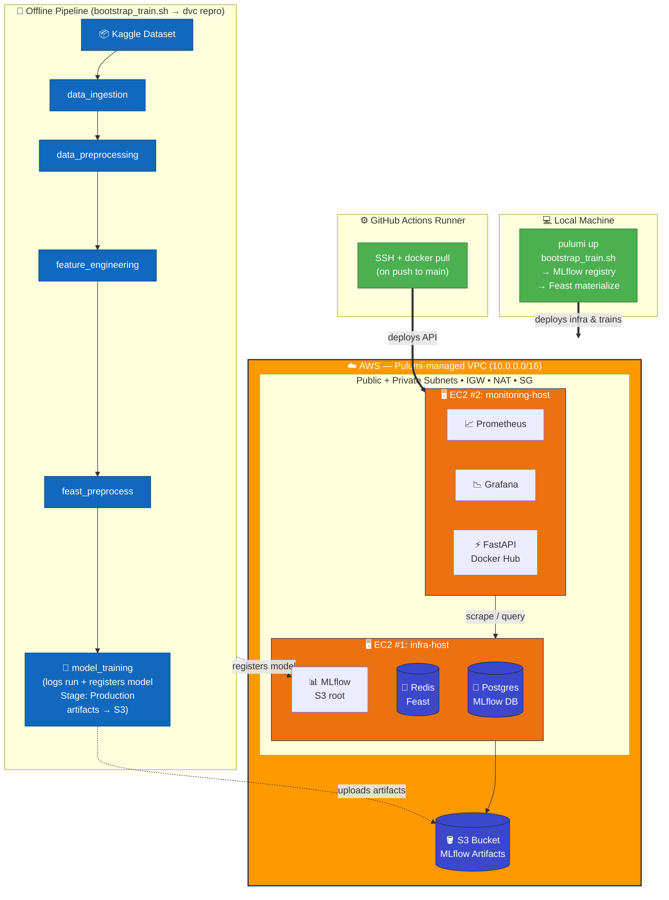

# ModelServe — Architecture Documentation

## System Overview

ModelServe is a production ML serving platform for credit card fraud detection. It uses a pre-computed feature store pattern: features are engineered offline via a DVC pipeline, materialized to Redis through Feast, and served at inference time through a FastAPI service backed by an MLflow-registered XGBoost model.

The system runs on AWS across **two EC2 instances** inside a Pulumi-managed VPC. CI/CD is handled by GitHub Actions (build → push to Docker Hub → SSH deploy to EC2 #2). Observability is provided by Prometheus + Grafana, both running on EC2 #2 alongside the API.



The FastAPI container on EC2 #2 reaches Postgres / Redis / MLflow on EC2 #1 over the **private VPC IP**, exposed to the container via `extra_hosts` in `docker-compose.yml` so the Feast config baked into the image (`connection_string: redis:6379`) resolves correctly.

---

## Architecture Decision Records (ADRs)

### ADR-1: Pre-computed Feature Store Pattern

**Context:** The API needs features at inference time. Options are: (a) send raw transaction data and transform in real-time, (b) pre-compute features offline and serve from a store.

**Decision:** Use a pre-computed feature store pattern. Features are engineered during the DVC pipeline, saved to a Feast-compatible parquet, materialized to Redis, and served at inference time via the Feast SDK.

**Rationale:**
- No real-time feature engineering code duplication between training and serving
- Sub-millisecond feature retrieval from Redis
- Training/serving skew is eliminated — the exact same transformed values are used
- Feast provides a standard SDK interface, versioning, and point-in-time join semantics

**Trade-offs:**
- Features are static snapshots — new transactions don't update features until re-materialization
- Entity lookup requires a known `cc_num` that exists in the feature store
- Adding new features requires re-running the pipeline and re-materializing

---

### ADR-2: XGBoost with `scale_pos_weight` Instead of Upsampling

**Context:** The fraud detection dataset is heavily imbalanced (approx. 0.5% fraud). Options: (a) upsample the minority class, (b) use class-weighted loss, (c) SMOTE.

**Decision:** Use XGBoost's `scale_pos_weight` parameter set to 50, with `handle_imbalance: false` in the DVC pipeline.

**Rationale:**
- Upsampling inflates the dataset size, increasing training time and memory usage
- `scale_pos_weight` achieves a similar effect by penalizing misclassification of the minority class
- XGBoost's native support for weighted loss is well-tested and computationally efficient
- Keeps the pipeline simpler — no synthetic data generation step

**Trade-offs:**
- Less control over the exact resampling strategy compared to SMOTE
- The weight value (50) may need tuning per dataset version

---

### ADR-3: Two-EC2 Topology on AWS (Pulumi)

**Context:** The starter offered three deployment topologies. The project needed an AWS-hosted setup that separates stateful infra (databases, registry) from the request-path (API + monitoring), without depending on managed services like RDS / ECS / EKS that this AWS account doesn't have permissions for.

**Decision:** Two EC2 instances inside a Pulumi-managed VPC:
- **infra-host** — Postgres, Redis, MLflow (with S3 as the artifact root)
- **monitoring-host** — FastAPI, Prometheus, Grafana

**Rationale:**
- Clear separation of concerns: state lives on EC2 #1, the request-path lives on EC2 #2
- Restarting / redeploying the API on EC2 #2 doesn't touch the model registry, feature store, or experiment tracking on EC2 #1
- Prometheus is co-located with the API for a low-latency scrape; Grafana is co-located with Prometheus so it can talk to it over `localhost`
- Avoids IAM (no `CreateUser` / `CreateRole` permissions needed); AWS credentials are injected as Pulumi secrets directly into the MLflow container so it can sign S3 requests
- Pulumi makes the whole VPC + EC2 + S3 layout reproducible with a single `pulumi up`

**Trade-offs:**
- No auto-scaling or load balancing — each EC2 is a single point of failure for the services it hosts
- An API redeploy is a `docker compose pull && up -d` over SSH rather than a managed rollout
- A real prod deployment would replace this with ECS/EKS, RDS, ElastiCache, and an ALB

---

### ADR-4: MLflow Model Registry for Model Versioning + Rollback

**Context:** The model needs to be versioned, loaded at API startup, and reversible — if a newly-promoted version misbehaves in production, the team needs to switch back to the previous version quickly without a redeploy.

**Decision:** Use MLflow's Model Registry with a Postgres backend store and S3 as the artifact root. The FastAPI service loads `models:/fraud-detection-model/Production` on startup and exposes a `POST /rollback` endpoint that:
1. Loads a chosen previous version into the live process via `mlflow.pyfunc.load_model`
2. Promotes that version to stage `Production` and archives the version that was previously serving
3. Updates the `model_version_info` Prometheus gauge so dashboards and `/health` reflect the change immediately

**Rationale:**
- MLflow provides experiment tracking (params, metrics, artifacts) out of the box
- Stage transitions (`Staging` → `Production` → `Archived`) give a natural rollback primitive
- The API loads models via `models:/{name}/Production` URI — decoupled from file paths or commit SHAs
- The rollback updates **both** in-memory state (so live traffic sees the change instantly) **and** registry stage (so a future container restart comes up on the rolled-back version) — no half-state
- UI at port 5000 enables visual comparison of experiment runs
- S3 as artifact root means the model itself is durable across EC2 replacements

**Trade-offs:**
- MLflow server adds another container to manage on the infra host
- Model loading on startup / rollback takes 5–15 seconds (cold load from S3)
- No traffic-splitting / canary on rollback — it's an atomic swap inside the process

---

### ADR-5: Prometheus + Grafana for Observability

**Context:** The service needs custom Prometheus metrics, alert rules, and Grafana dashboards covering prediction latency, error rates, throughput, and feature-store health.

**Decision:** Expose Prometheus metrics from the FastAPI app at `/metrics`, scrape with Prometheus, visualize with Grafana. Both the Prometheus datasource **and** the ModelServe dashboard are auto-provisioned from `monitoring/grafana/provisioning/`.

**Rationale:**
- `prometheus-client` integrates directly with Python — no sidecar needed
- Counter, Histogram, and Gauge metric types cover all requirements (request rates, latency histograms, model version)
- Auto-provisioning keeps the dashboard in version control as JSON; the Grafana volume can be wiped without losing it
- Alert rules are defined declaratively in `monitoring/prometheus/alerts.yml` and loaded by Prometheus
- Industry-standard stack with extensive community documentation

**Trade-offs:**
- Customizing panels in the Grafana UI requires re-exporting the JSON to keep version control honest
- No distributed tracing (would need Jaeger / OpenTelemetry for that)
- Alert notifications (email, Slack) require additional Alertmanager configuration beyond what ships in this repo

---

### ADR-6: CI/CD via GitHub Actions → Docker Hub → SSH Deploy

**Context:** API code changes need to land on EC2 #2 without manual `scp`/`rsync` and without granting the runner any AWS IAM permissions.

**Decision:** A `.github/workflows/deploy.yml` workflow runs on every push to `main`:
1. Run `pytest` against the mocked test suite
2. `docker buildx` the FastAPI image and push to Docker Hub as `:latest` and `:<sha>`
3. SSH into EC2 #2 using a deploy key stored as a repo secret and `docker compose pull && up -d --force-recreate api`

**Rationale:**
- Image build + push is the single source of truth for what runs in prod
- No AWS credentials live on the runner — only an SSH key and Docker Hub token
- `--force-recreate api` swaps just the API container; Prometheus and Grafana on the same host keep their state
- The SHA tag means any prior image is still pullable for a manual rollback

**Trade-offs:**
- A failed SSH step leaves the previous image running — visible in the workflow log but not auto-rolled-back
- Docker Hub is a public dependency for a private deployment; an ECR migration would tighten this up

---

## API Endpoints

| Endpoint                            | Method | Purpose                                                       |
|-------------------------------------|--------|---------------------------------------------------------------|
| `/health`                           | GET    | Liveness + current model version                              |
| `/predict`                          | POST   | Score `entity_id` (cc_num) via Feast + MLflow model           |
| `/predict/{entity_id}?explain=true` | GET    | Score + return the feature vector used                        |
| `/rollback`                         | POST   | Switch to a previous registered model version (live, in-proc) |
| `/metrics`                          | GET    | Prometheus exposition (counters, histograms, gauge)           |

Prometheus metrics exposed: `prediction_requests_total`, `prediction_duration_seconds`, `prediction_errors_total`, `model_version_info`, `feast_online_store_hits_total`, `feast_online_store_misses_total`. The `prediction_errors_total` counter has an `error_type` label that includes `feature_not_found`, `prediction_error`, and `rollback_error`.

---

## Runbook

### Initial Setup (fresh AWS account)

```bash
# 1. Clone the repo
git clone https://github.com/<your-username>/modelserve.git
cd modelserve

# 2. Provision AWS infra (VPC, 2x EC2, S3, SG, key pair)
chmod +x scripts/bootstrap_infra.sh
./scripts/bootstrap_infra.sh

# 3. Train + register the model into the remote MLflow + materialize Feast features
chmod +x scripts/bootstrap_train.sh
./scripts/bootstrap_train.sh

# 4. Push to main — GitHub Actions builds the image, pushes to Docker Hub,
#    SSHes into EC2 #2 and brings the API up.
git push origin main

# 5. Verify
curl http://<monitoring_host_public_ip>:8000/health
curl http://<infra_host_public_ip>:5000           # MLflow UI
curl http://<monitoring_host_public_ip>:9090/-/healthy   # Prometheus
```

### Smoke-testing the API

```bash
API=http://<monitoring_host_public_ip>:8000

# Health
curl $API/health

# Predict
curl -X POST $API/predict \
  -H "Content-Type: application/json" \
  -d @training/sample_request.json

# Predict with explanation
ENTITY_ID=$(python3 -c "import json; print(json.load(open('training/sample_request.json'))['entity_id'])")
curl "$API/predict/${ENTITY_ID}?explain=true"

# Prometheus metrics
curl $API/metrics
```

### Rolling back to a previous model version

Whenever `bootstrap_train.sh` is re-run, a new version of `fraud-detection-model` is registered in MLflow and promoted to `Production`. If the new version misbehaves:

```bash
# Auto rollback — picks the most recent prior version
curl -X POST http://<monitoring_host_public_ip>:8000/rollback

# Or roll back to a specific version
curl -X POST http://<monitoring_host_public_ip>:8000/rollback \
  -H 'Content-Type: application/json' \
  -d '{"version": "2"}'
```

What it changes:
- The FastAPI process now serves the target version (no container restart, no redeploy).
- MLflow stages are updated: target → `Production`, previously-serving → `Archived`. A future restart of the API container comes up on the rolled-back version.
- The `model_version_info` Prometheus gauge updates; `/health` and the Grafana "Active Model Version" panel reflect the change immediately.

If the target version doesn't exist or the registry contains only one version, the endpoint returns `400` with a descriptive error. If the in-memory load itself fails, the previously-loaded model keeps serving traffic (no half-swapped state).

### Running tests

```bash
pytest app/tests/ -v
```

Tests mock both MLflow and Feast — no AWS / infra required. The same suite runs in CI as the first step of the deploy workflow.

### Common troubleshooting

**API returns "No features found"**
- The `entity_id` isn't in the materialized Feast store. Use one from `training/sample_request.json`.
- The Feast registry on disk may be stale. Re-run `bootstrap_train.sh` (it does `feast apply` + materialize at the end).

**MLflow model load fails on API startup**
- Check the MLflow UI at `http://<infra_host_public_ip>:5000` — make sure `fraud-detection-model` has a version in stage `Production`.
- Re-run `bootstrap_train.sh` to push a fresh `Production` version.

**`/rollback` returns 400 with "No prior version available"**
- The registry only has one version. Re-run training to push a second version before rollback becomes possible.

**`docker compose pull` on EC2 #2 fails in CI**
- Check the `DOCKERHUB_USERNAME` / `DOCKERHUB_TOKEN` repo secrets and that `DOCKER_IMAGE` matches the repo on Docker Hub.
- Check the `EC2_SSH_KEY` secret contains the full PEM (BEGIN / END lines included).

### Scaling considerations (beyond this project's scope)

- Replace the two-EC2 layout with ECS / EKS for horizontal scaling of the API
- Use RDS for Postgres and ElastiCache for Redis instead of self-hosting on EC2
- Put the API behind an ALB with an auto-scaling group
- Add a streaming feature pipeline (Kafka → Feast) for real-time feature updates
- Replace SSH-based deploys with an ECS service update / blue-green rollout

---

## Known Limitations

1. **Features are static snapshots.** Feast serves features materialized at pipeline run time. New transactions are not reflected until the pipeline re-runs and features are re-materialized.

2. **Two-EC2 deployment, no HA.** Each EC2 is a single point of failure for the services it hosts. There is no auto-scaling or load balancing.

3. **No authentication on API endpoints.** Notably, `POST /rollback` is unauthenticated — in a real deployment this would sit behind an API key, an IAM-authed ALB, or at minimum be restricted to the VPC.

4. **`cc_num` entity lookup only.** The API can only predict for `cc_num` values that exist in the materialized feature store. Unknown credit cards return a 400 error.

5. **Model cold start.** The API loads the model from MLflow on startup (and on every rollback) — this takes 5–15 seconds against S3. During API startup, predictions fail and `/health` reports `unhealthy`.

6. **Rollback is an atomic swap, not a canary.** `POST /rollback` flips 100% of traffic to the target version in-place. There's no traffic splitting or shadow comparison.

7. **Alert rules ship without a notification channel.** `monitoring/prometheus/alerts.yml` defines the alerts but Alertmanager / Slack / email routing is not configured.